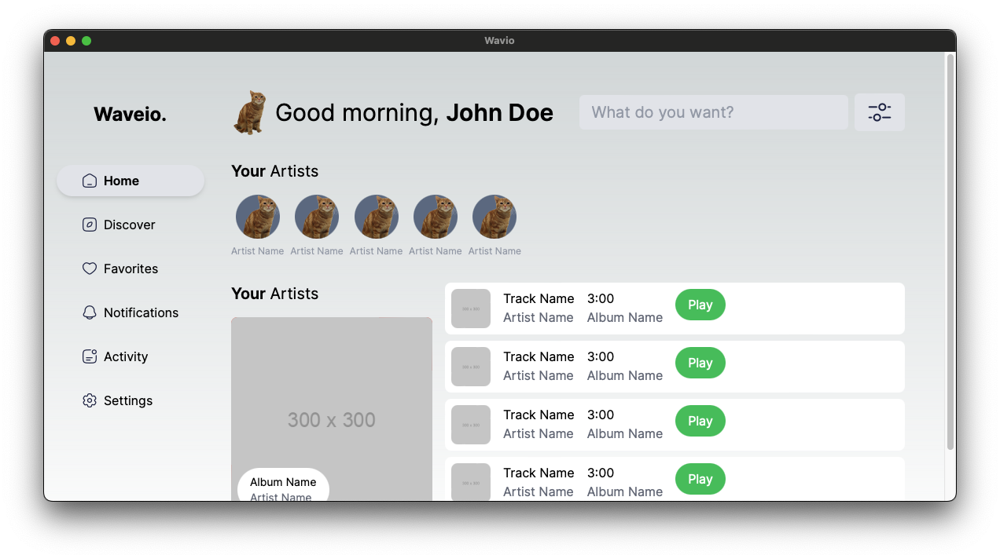

# Getting Started with Wavio

This project is a web application built with Next.js and packaged with Tauri for a native desktop experience.

It is a simple audio player that can play .wav files. Atleast that is the goal.

<!-- insert preview.png from docs/ -->


## Prerequisites

Before you begin, ensure you have met the following requirements:

- Node.js and npm installed (you can download them from [here](https://nodejs.org/en/download/))
- Rust and its package manager Cargo (you can download them from [here](https://www.rust-lang.org/tools/install))

## Installation

1. Clone the repository:

```bash
git clone https://github.com/your-username/wavio-app.git
```

2. Navigate into the project directory:

```bash
cd wavio-app
```

3. Install the dependencies:

```bash
npm install
```

## Running the Application

### Start the application in the webbrowser:

```bash
npm run dev
```

### Start the application as a desktop app:

```bash
npm run tauri dev
```

This will open a new window with your application running as a desktop app.

## Contributing

If you want to contribute to this project, please fork the repository and create a pull request.

## License

This project uses the following license: [MIT License](https://opensource.org/licenses/MIT).

## Contact

If you want to contact me, you can reach me at `gostavdev@gmail.com`.